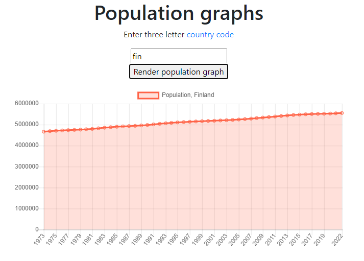
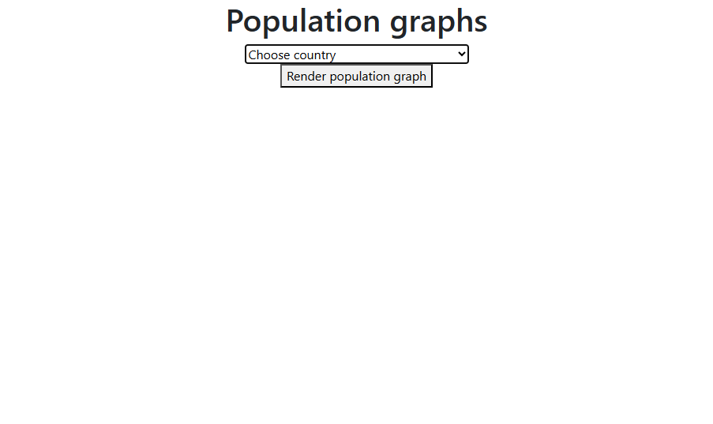
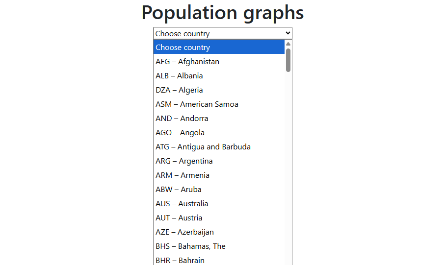
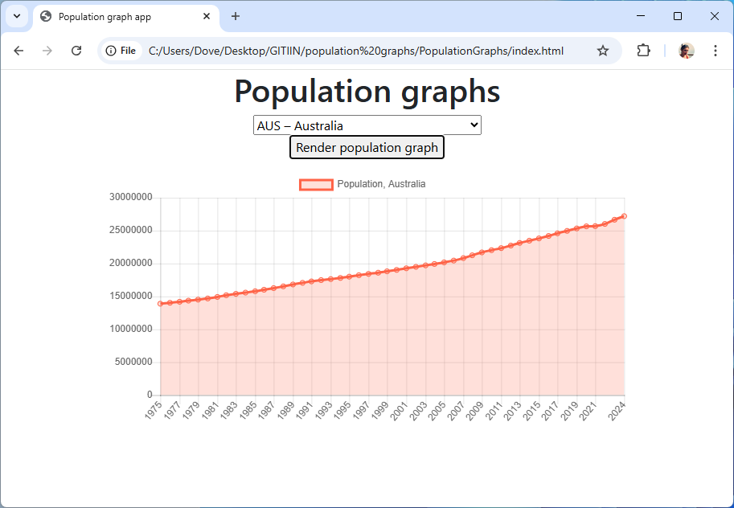

# Population Graphs App

This project is part of the **Web Coding for Beginners: Population Graphs** course organized by #mimmitkoodaa MOOC by Sympa. 

The idea was to create a simple web application within one day. 
I also earned a course certificate upon completion.

## Overview

The Population Graphs App is a web application that displays population graphs for various countries. It uses HTML, CSS, JavaScript, and real JSON data from the World Bank API.

## Features

- View population graphs for different countries
- Interact with the graphs to explore data for specific years

## Link to the app
[Population Graphs](https://dovile-mart.github.io/PopulationGraphs)

# 
### Population Graphs v.1
<!---->

### Population Graphs v.2

<!-- 

-->
